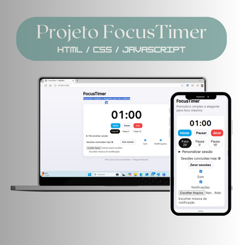

# ⏱️ FocusTimer — BabyDev 👶💻

**Um Pomodoro simples, moderno e feito para quem quer transformar minutos em conquistas!**

O **FocusTimer** foi criado para ajudar estudantes e profissionais a manterem o foco, organizarem o tempo e celebrarem cada sessão concluída.  
Com interface intuitiva, personalização de notificações e visual responsivo, este projeto é ideal para quem busca produtividade sem complicação.

> “O tempo é o recurso mais valioso que temos. Use cada minuto para construir o seu melhor!”

---

## 📸 Mockup do Projeto



---

## 🚀 Como usar

1. Escolha o tempo de foco ou pausa.
2. Personalize o tempo se desejar.
3. Ative notificações e som.
4. Escolha sua música de notificação.
5. Clique em **Iniciar** e foque no seu objetivo!

---

## ✨ Recursos

- ⏰ Modos de foco (25') e pausas (5' / 15')
- 🔄 Sessão personalizada
- ▶️ Iniciar / ⏸️ Pausar / ⏹️ Zerar
- 📊 Contador de sessões concluídas (por dia)
- 🔔 Som ao finalizar e Notificações do sistema
- 💾 Salvamento de sessões com `localStorage`
- 📱 Layout **100% responsivo** (desktop e mobile)

---

## 🛠️ Tecnologias Utilizadas

- **HTML5**
- **CSS3**
- **JavaScript (ES6+)**

---

## 📦 Como rodar o projeto

1. Clone este repositório:
   ```bash
   git clone https://github.com/SEU-USUARIO/project_FocusTimer.git


